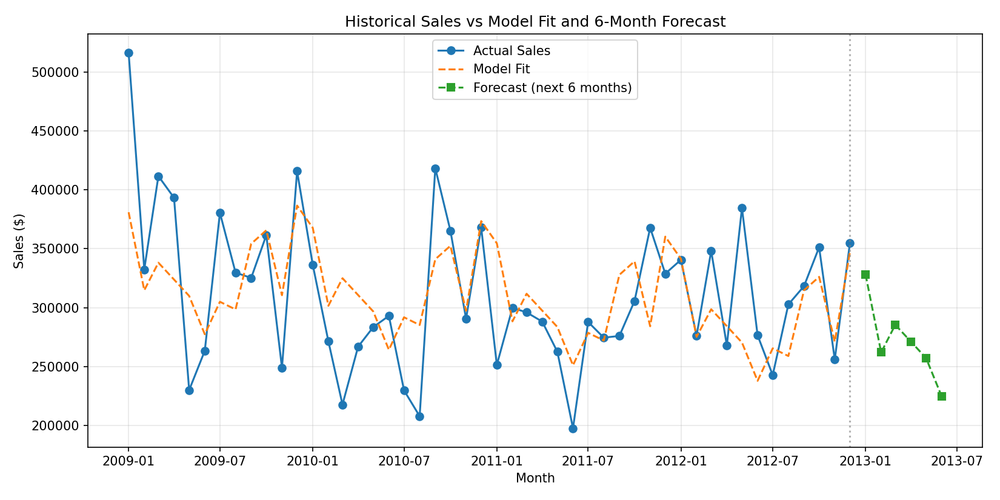

# Retail Sales Forecasting (Predictive Analytics)

Builds a regression-based time-series model to forecast future retail
sales from historical order data — capturing trend and seasonality to
predict revenue for the next 6 months.



## Objective

Forecast future retail sales trends using historical order-level data
(Superstore dataset, 2009–2012), and evaluate how reliable that forecast
actually is before trusting it.

## Approach

1. **Load and clean** historical order-level data (8,400 orders, 2009–2012)
2. **Aggregate** into a monthly sales time series
3. **Explore trends and seasonality** (EDA) — monthly sales are volatile
   with no single dominant trend, but a repeating month-to-month pattern
4. **Engineer features**: a linear time trend (`t`) + one-hot encoded
   calendar month, to jointly capture trend and seasonality
5. **Train/test split**: hold out the last 6 months as an honest test of
   forecast accuracy on unseen future data
6. **Evaluate** the model on that held-out period
7. **Forecast** the next 6 months and visualize actual vs. fitted vs.
   forecasted sales

## Results

Evaluated on 6 held-out months the model never trained on:

| Metric | Value |
|---|---|
| MAE | 27,501 |
| RMSE | 32,949 |
| R² | 0.411 |
| MAPE | 9.2% |

A MAPE of ~9% means the model's monthly sales predictions are, on
average, within about 9% of the true value on data it had never seen —
a sign it's picking up genuine seasonal signal rather than overfitting
to noise.

The model was then refit on all available data and used to forecast the
next 6 months of sales.

## Tech stack

- Python
- pandas / numpy — data cleaning and time-series aggregation
- scikit-learn — Linear Regression, evaluation metrics
- matplotlib — visualization

## Project structure

```
retail-sales-forecasting/
├── Predictive_Analytics_Sales_Forecast.ipynb   # full notebook, code + outputs
├── superstoreSales.csv                          # dataset
├── forecast_plot.png                             # actual vs fit vs forecast chart
└── README.md
```

## How to run

```bash
git clone https://github.com/<your-username>/retail-sales-forecasting.git
cd retail-sales-forecasting
pip install pandas numpy scikit-learn matplotlib jupyter
jupyter notebook Predictive_Analytics_Sales_Forecast.ipynb
```

## Possible extensions

- Compare against a proper time-series model (SARIMA, Prophet) as a
  baseline check on the regression approach
- Add confidence intervals around the forecast, not just point estimates
- Incorporate additional features (discount rate, category mix) as
  external regressors
- Backtest across multiple 6-month windows instead of a single split, to
  check how stable the ~9% MAPE is over time

## Author

<Your Name>
